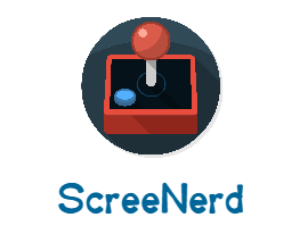

# screeNerd 

Notre idée de projet est un réseau social de partage de captures d’écrans (screenshots) dédié à l’univers vidéo-ludique. Les joueurs du monde entier pourront ainsi partager leurs plus belles captures dans un ensemble de catégories, dont une générale englobant tout le contenu.

Pour utiliser l’application, les utilisateurs devront créer un compte.
Ils auront la possibilité de noter les captures des autres joueurs, et même de laisser un ou plusieurs commentaires sur leurs captures préférées. Les captures les mieux notées apparaîtront ainsi sur une page dédiée et changeront chaque mois.

L’objectif du site est uniquement de partager des images de jeux, et n’a pas (pour le moment) vocation à faire communiquer les utilisateurs autrement qu’à travers l’espace de commentaire.

L’application peut se voir comme un Pinterest-like dédié à l’univers vidéo-ludique.

## Définition de prêt : 
  - le démarrage d'une story n'est pas génée par une story non terminée (selon la définition de fini)
  - les tests d'acceptation ont été écrits et validés par les membres du groupe

## Définition de fini : 
  - les tests d'acceptation sont passés
  - 0 bugs et 0 vulnérabilités sur SonarQube
  - les tests d'intégration sont tous acceptées
  - les tests unitaires sont tous acceptés

## Intégration Continue:

https://travis-ci.org/Master-DL/projet-ivvq-2017-2018-tema-benssa

## Qualité de code:

https://sonarcloud.io/dashboard?id=com.screenerd-travis-project

https://codecov.io/gh/Master-DL/projet-ivvq-2017-2018-tema-benssa

## Déploiement:

https://screenerd.herokuapp.com/